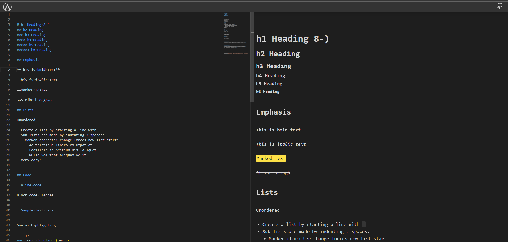

# mdPreviewer

Example App using the [@edllx/md-parser](https://github.com/liolle/mdParser) and [solidjs](https://www.solidjs.com/) to render a markdown file.

## [Demo](https://md-viewer.kodevly.com/)

## Features

| Name           |          |              |          |
| -------------- | -------- | ------------ | -------- |
| Heading        | &#x2705; | Tables       | &#x274c; |
| Unordered list | &#x2705; | Ordered list | &#x274c; |
| Bold           | &#x2705; | Quotes       | &#x274c; |
| Italic         | &#x2705; | Unicode      | &#x274c; |
| Links          | &#x2705; |              |          |
| Inline code    | &#x2705; |              |          |
| Code block     | &#x2705; |              |          |
